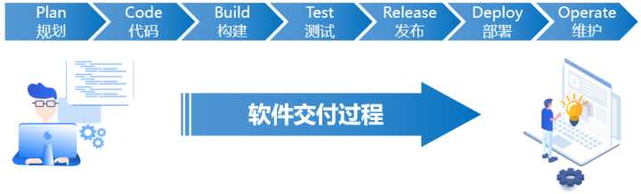
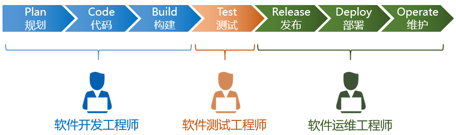
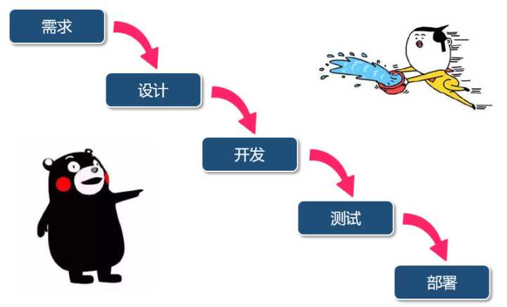
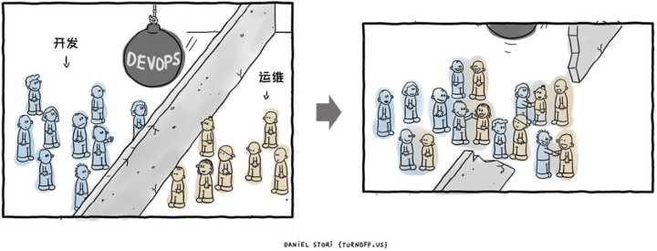
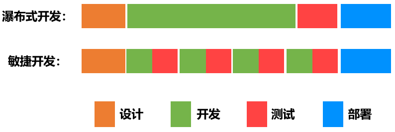

#### 阅读InfoQ【为什么一定要从 DevOps 走向 BizDevOps？】 文章有感
文章原因是：https://mp.weixin.qq.com/s/EYU6oaz-EymVRmq5LmbOag
### DevOps是什么？
DevOps 于 2009 年被提出，主要是为了打破 Dev 与 Ops 的墙。当时的墙还是比较明显的。Dev 关注的是快，对象是代码，Ops 关注的是稳，对象是机器。两者目标天然有矛盾，部门墙由此建立起来，这当然不利于 IT 价值的最大化。

2009 年，在美国举行的第二届 Velocity 大会上，来自 Flickr 公司的 John Allspaw 和 Pauk Hammond 发表了一个演讲《10+ Deploys Per Day: Dev and Ops Cooperation at Flickr》。在这个演讲中，Allspaw 和 Hammond 以角色扮演的方式，生动地表现了开发与运维之间的各种冲突。演讲中出现很多金句，如“It's not my code, it's your machines!”，这深刻反映了 Dev 和 Ops 关系的现状。接着，他们又展示了开发团队（Dev 和运维团队（Ops 如何通力合作，借助工具消除双方间的壁垒。

这次演讲是 DevOps 发展历程中的标志性事件。它提出了正确的问题：为了更快交付和实现价值，必须弥合开发和运维之间的鸿沟，并给出了解决方案：为了弥合开发和运维之间的鸿沟，需要在文化、工具和实践方面的系列变革。

### BizDevOps是什么？
DevOps 运动还没结束，仍在继续发展。DevOps 运动有很多可以给 BizDevOps 借鉴的地方。

首先，是在目标上进行统一。DevOps 为了统一目标，借鉴了精益管理、敏捷管理、看板等工作方法，打通了整个 DevOps 流程，产生了非常好的对于管理方法的驱动。其次，DevOps 在开发和运维之间找到了共同点。大家关注的是应用，以应用为中心去做开发，演变成了阿里和微软的 OAM 模型。因此，既要有理念和方法上的改变，还要用技术手段来解决问题，这是我们需要从 DevOps 运动中学习和借鉴的。

那么，业务和技术的共同目标是什么？在流程中有什么共同关注的东西？共同的目标、共同的关注点，有效的技术或者工程实践，是 BizDevOps 落地的关键。

首先，要把业务、DevOps 统一起来，统一语言非常重要。业务和技术有墙是正常的，因为业务间本身可能就有割裂。以银行为例，每个部门画图的标准不一，统一业务的语言就有难度。业务之间先统一语言，然后和 IT 用统一的语言沟通，然后统一数据和业务。从基础语法到长期熟练地使用语法，制定业务标准、数据标准，行业上下游企业定义好标准，这个过程的整合需要时间。

对于软件行业来说，DevOps 代表第一生产力，数据代表软件下的生产资料。DevOps 发展多年，相对来说已经很成熟，因此成为快速迭代、试错的实验系统。在已经有这套系统的情况下，Biz 就更应该好好利用这个系统。

现在，可以把 Biz 放在 DevOps 前面，后续也可以把 Biz 放在 DevOps 后面。这意味着业务不是拍脑袋做的，而是有数据验证的。Biz、Dev、Ops 这三个单词不应该是在一条线上，而应该是一个环，加入数据这个生产要素之后，我们可以用实验精神来创造一些商业机会。

### 个人收获
上面是内容的摘抄，虽然不知道我的理解是否是文章期望的那样，但我还是想写一下我读了这篇文章后，我的收获。

    PS：可能理解偏题，但我还是想写。

在我过往的工作中，更多的是biz+devOps，即业务、开发独立分开，业务从提出到上线，往往要最少1个月，甚至半年起，这对业务发展无疑是巨大的打击。

目前来到了新公司，也是第一次听业务部门与技术部门联合起来，即业务部门的业绩直接和技术挂钩，技术也是围绕着业绩去进行考核，这个方式一开始我理解不了，做技术还要去了解市场，还要懂运营吗？

看了这篇文章后逐渐理解到上级安排的内在涵义，以前我一直吐槽，看来确实是我短见了，有时候看到和自己认知不同的事情时，不要急着吐槽，更多地去调查了解一下，可能是自己太短见，瞎吐槽反而显得自己愚蠢。

    PS:事情存在即合理，不要遇到与自己认知不一样的事情就忙着吐槽，多些调查了解背后的含义更加重要，
    不加思索的吐槽只会显得自己更加短见。

### 于是我想了解<strong>DevOps的由来</strong>

于是我发现这篇文章：https://blog.csdn.net/qq_42095014/article/details/118187000

从

发展到

DevOps

    PS:上面几张图摘抄自链接，DevOps是一种思想，是从需求、设计、开发、测试、部署 瀑布式，转换成 敏捷式。

    PS:这个思想的前提下才慢慢出现容器化这类技术，和CI/CD这些东西，也是这些东西推动DevOps思想成为潮流，并得以实现。

    PS:DevOps先于技术出现，技术根据这个思想发展后，才慢慢实现思想，并最终成为潮流。

但从上面这篇文章中，引发起我的一个思考。

### 什么是**敏捷开发**？
了解敏捷开发，虽然翻看了一些链接，但没有找到很好的，这里留个空。

    PS:说下自己理解，像以往的瀑布式，往往是一个完整的功能交付，交付一个整体的过程。敏捷开发，是把大功能变小，让用户看到循序渐进的变化的过程。
    PS：瀑布式：我想做一个大功能，提交了一份报告，开发周期较长，市场变化后又需要等第一期结束后才能修改，不断循环，永远追不上市场。
    PS:敏捷开发：我想做一个大功能，我先做了一个主线，或者一小部分交付，后面的扩展再慢慢填充，市场改变我也能在下一个周期修改，周期间隔越短越好。

上面是我的理解，我回想起我们以前往敏捷开发转型，失败的原因是领导没有把其思想同步给大家，大家都不知道什么是敏捷开发，实际上领导也不知道什么是敏捷开发，
就说要做这个事情，最终仍然是不伦不类，辛苦了开发们。

结合我今天对这件事的理解，我认为过去的方式实际上仍然事瀑布型，我想试试用一个业务如果给我去领导，瀑布型的流程和敏捷型的流程分别是怎样？

### 说说我印象深刻的【团长业务】
团长业务大致是这样的（时间也比较久了，记不清），团长从企业拿货在自己地头售卖，团长每笔订单获得分成。于是团长就分为：用户下单、团长拿货、erp采购后发货、实际到货清点、用户取货。
其实际业务类似于次日达业务。但其业务是C to C ，由于是C to C 所以并不保证货100%能到达用户手中，有可能没货给不了，最终也只是影响团长的信誉，不影响企业，所以其业务上允许部分发货。

在我拿到团长这个需求时，了解到其大部分的逻辑都是与订单流程一直，仅仅是部分发货目前流程不能满足，因为目前订单是整体自提，不能部分自提，如果要让当下订单支持部分自提，会涉及较多技术细节改动，
但此项目是试点项目，我认为虽然可以通过改造订单实现部分自提，但如果是试点，我是不会改动主流程的。所以提出【记本子】策略，就是通过记录流水的方式，模拟团长是如何交付商品的，即团长
交付商品后，记录交付数量和对应的订单，每天对这些流水进行统计（与erp结算时间点前），当天领取完的，触发订单为履约完成，走现有的结算流程。当出现部分领取的情况下，根据【小本子】
内容与erp结算，因为订单仍是未履约，所以正常订单不会进行结算，仅结算【小本子】流水。待最后一笔完成后，订单先修改结算状态为已结算（即现有订单不与erp结算），后改订单状态为履约完成，
这个方式下，当业务被废弃，我可以直接拿掉【小本子】相关业务，而不影响订单的任何流程，也不会对订单代码有任何入侵。

    PS：由于领导安排了一个新人产品跟进这个问题，这个产品能力优秀，但此功能需要拉通多个业务方，而且是重点项目，领导安排一个新人去跟进，肯定出问题，
    项目过程，需求文档都经历多次修改，最终耽误了很久才把开发文档给出，此时开发已经无时间。

OK,说了这么多废话，我试试瀑布型的开发流程是怎样？

### 请用瀑布型流程，描述出【团长业务】如何交付
* 【产品】：调研业务，频繁奔跑于各个业务方，为了能给出一份逻辑严谨的需求文档，产品不断修改，期间业务方也摇摆不定，产品也每天加班修改。时间在流逝~
* 【开发】：deadline是定的，业务在变化，开发拿到手进行分析开发时间已所剩无几，此时开发也在加紧的做。从头到尾，从开始到结束，
* 【测试】：测试也很急，天天催开发，一直等待，开发交付后，测试介入。
* 【运维】：发布上线

4个角色串行工作，按部就班，一个结束后到下一个，1个月时间，大家都在等待，

* 产品认为：业务都没定，我怎么给开发。

* 开发认为：功能都没写完，我怎么提测?能不能部分提测？

* 测试认为：开发就不能加班完成？啥？部分提测？给我个按钮我点一下吗？测试测的是全流程，一个小功能点有问题也测不出来啊。

* 运维认为：每次都这么赶，到时候又不知道出什么问题了。

that's all ,next

### 敏捷型开发流程【团长业务】
【领导】：团长业务分为：用户下单、团长拿货、erp采购后发货、到货清点、用户取货、团长财务结算。这里涉及3个变量 
* ERP的业务问题，我以什么样的形式提高下单，和你以什么形式给我货，并且清点业务是怎样。 
* 业务方，这里我没法列出来，当初我不在那个组，我没法知道这个细节 
* 业务方确定后，技术能否实现，是能实现，还是妥协后能实现，还是不能实现 

然后划分出确定性与不确定性：确定的是：团长的业务的主流程是确定的  不确定性是ERP和业务方的一些细节。

* 需求来看，团长拿货是可以先做的，因为团长从我们业务系统拿货，我们系统记录后才与ERP交互，起码这个拿货环节能先做。
* 到货清点不能先做，因为清点逻辑需要依赖ERP返回的数据，虽理论上可以做中间层解耦，但是没必要吧，暂且分配成可做但不紧急。
* 用户取货这个能做，但属于妥协后能实现的类型，用【小本子】的方式做。
* 财务结算这个不能先做，业务方和ERP不确定，我这边也不能做，因为这个公司的ERP不怎么开发，很多业务都是我们咀嚼后给ERP直接消化的，ERP本身不做太多的逻辑。
这也是痛点

OK，目前可以确定能做的是：用户下单、团长拿货、用户取货3个功能。 到货清点 看资源再安排，结算业务你们慢慢确认，目前按不结算逻辑做。
如果可以，我希望能多一个产品去做这件事，并且两个产品思想要统一，产生分歧麻烦找我确定。
First
* 【产品】：提供【用户下单】、【团长拿货】、【用户取货】3个的需求文档，最终实现从下单到拿货的全流程。
* 【开发】：了解了全链路后，获得【用户下单】需求，表设计，然后开发
* 【测试】：保证用户下单后，数据库表有，前端能正常显示，其状态为未推送或未下单
* 【运维】：看看你们要分开上还是一起上咯，最近有个版本。
Second：
* 【开发】：获得【团长拿货】文档，表设计，然后开发
* 【测试】：保证 用户下单后的数据能挂靠到对应的团长中，每个数据能通过团长id获得，分成做在哪可以后面定，大不了加字段。
* 【运维】：看看你们要分开上还是一起上咯，最近有个版本。 
Third：
* 【产品】：获得ERP相关接口和清点逻辑、业务方还在吵架，于是需要根据现有功能指定清点流程，如果需要修改旧流程，就放在下一个版本改，在之前基础上调整。
* 【开发】：进行【清点】开发，并根据【清点】做兼容性，测试需要就兼容性进行覆盖测试。
* 【运维】：看看你们要分开上还是一起上咯，最近有个版本。 
Forth:
* 【产品】：业务方定下来了，全部文档补全，查漏补缺吧。
* 【开发】：完成剩余功能。
* 【测试】：测试回归新流程+全流程。
* 【运维】：之前上了几个版本机器性能监控没有变化，现在也可以上（这个实际上半成品功能，没有流量，这其实是个风险点，只不过起码上线配置文档内容会少点）。

写完后感觉是不是时间会更加长啊，感觉更加繁琐了，敏捷开发变化的因素太多，并且确实需要产研测3放更加密切的交流，这也是敏捷开发需要站会来同步信息的原因吧，
所以并不是站会就是敏捷开发，由于敏捷开发更加需要交流同步，无论是产品与产品，开发与开发，还是产品与开发，开发与前端，都需要更多地交流，
产品与业务方的沟通结果也需要进行同步，让开发留个底。
    
    PS：需求拆分;上面一坨脑补下来，我意识到敏捷开发确实是并行开发，先把确定性定下来，不确定性留空，确定性拆分成
    具体功能块交付给开发，开发在知晓整体的情况下，完成自己的小块，并交付测试，测试保证每个小块测试通过
    并在最终串起来测试，完成交付，期间可以安排上线，这样可以避免一口气一大坨文档给运维，拆分成小文档也
    能更好的让运维有心情帮你看看SQL是否合理。
    
    PS2：信息同步;并不是有站会就是敏捷开发，而是敏捷开发这种思想下，需要大量的信息同步，其信息同步的内容多种多样,
    由于不确定性的存在，和变化性，我们需要站会去同步一些信息，例如业务方变了xxxx，确定了不改了，
    也不让业务方改了的前提下，要求开发去改，同时同步给测试，如果影响较大，就放到下一份文档中去。
    
    PS3：产研测三足鼎立，均衡相处;并且产研测三方应该均衡，并不是产品提出来开发就要做，也不是开发说将就，
    测试就可以放过。三方既要维护自己的专业看法，也要成为整体共同去保证上线。业务是否不可妥协、这个用户体验是否不可妥协等。

经历过一些脑洞和一些整理后，我整理了一些收获，PS内容就是，但目前我所在工作地无法让我操作，但我仍然会进行一些经验整理，
大家能往一个目标共同努力确实很开心，但也很累，我可能后面也很难再有这些激情了吧。毕竟经历有限。

    PS：有时候满腔热血的时候，可能遇到一个菜鸡领导，最后领导积累了经验，而我们磨灭了激情。等到后面遇到一个优秀的领导时
    我可能已经不能燃烧自己的鸡血了。
